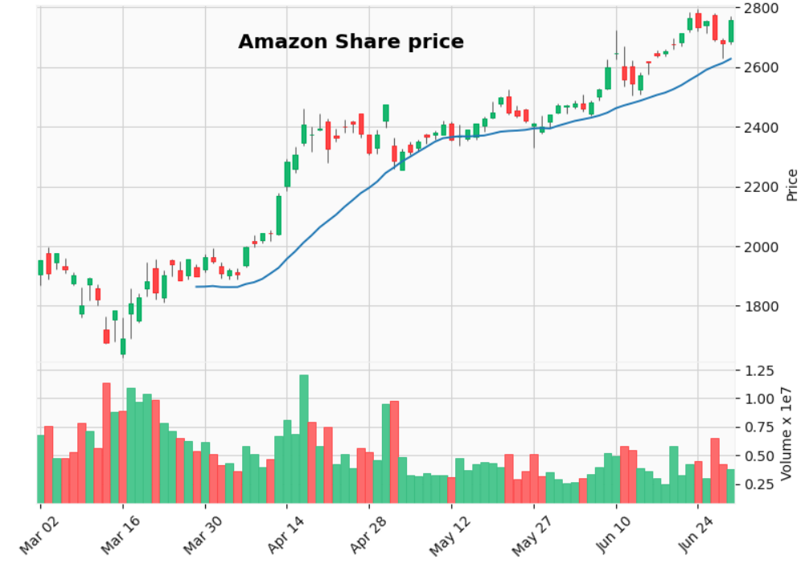
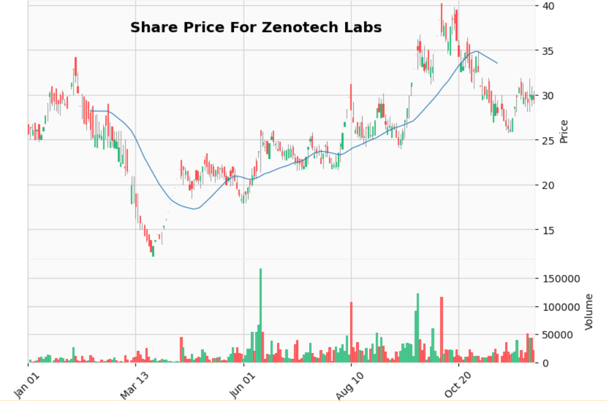

# Candle-Graph-for-shares

This is a candle graph prepesentation of shares of AMAZON and ZENOTECH LABS.
Library used :- [MPLFINANCE]. This has a framework of matplotlib and is a very useful library for plotting shares related graphs.
The csv file can be downloaded from historical column in (in.finance.yahoo.com) link.

For AMAZON:-

For Zenotech labs:-

